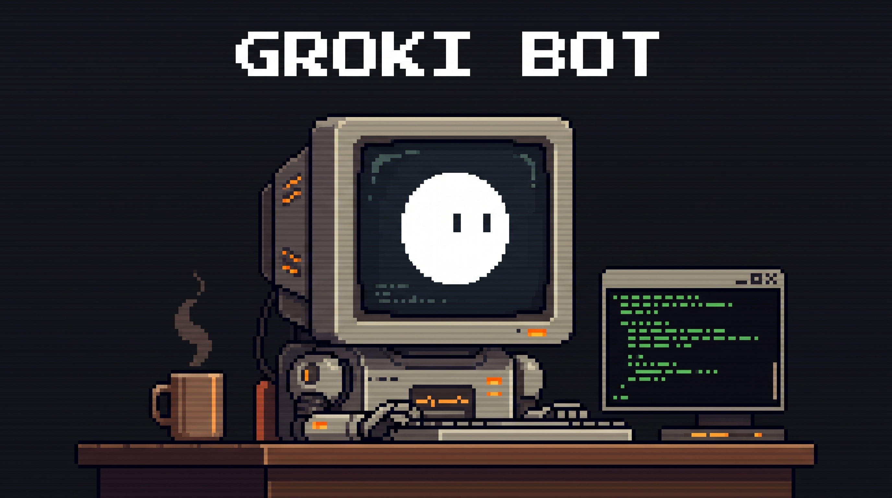

[English](README.md) · 中文 · [日本語](README.ja.md)

# Groki Bot

Groki Bot 桌面机器人（M5Stack CoreS3 加 Stack-chan 底座）的全部内容都在这一个仓库里：机器人**固件**、运行在电脑上的**网关**，以及让机器人把任务交给 **Grok Bot** 应用里智能体的联动机制。


<!-- demo-video
     演示视频后补。发布后把嵌入代码（iframe 或 video）放在本注释块下方。
-->

## 三种用法

每种用法都在前一种的基础上增加，先从用法 1 开始。

| | 能做什么 | 需要什么 |
|---|---|---|
| **1. 只刷固件**（先走这条） | 用你自己的密钥，通过 OpenAI Realtime 或 Google Gemini Live 和机器人语音对话 | 机器人、USB-C 线、桌面版 Chrome 或 Edge、一把 OpenAI 或 Gemini API 密钥 |
| **2. 加网关** | 「Hey Groki」唤醒词，语音经电脑走 Gemini Live；在带摄像头的 Mac 上，头会跟着你的脸转；Claude 等 MCP 客户端能让机器人说话、读取它的状态 | 用法 1 的全部，加一台和机器人在同一 Wi-Fi、运行 [gateway/](gateway/README.zh-CN.md) 的电脑，以及一把 Gemini API 密钥 |
| **3. 再加 Grok Bot** | 说「帮我查一下」「帮我调研 X」，机器人把任务交给你在 Grok Bot 应用里的智能体，智能体每回一段就念一段 | 用法 2 的全部，加上在那台电脑上登录的 Grok Bot 应用和 `gbot` 命令行 |

各部分怎么通信（端口、协议、消息流程、每部分需要什么）：[架构与通信说明](docs/architecture.zh-CN.md)。

```
 机器人 ──（用法 1）wss──▶ OpenAI Realtime / Gemini Live
   │
   └──（用法 2）ws://<局域网 IP>:8765──▶ 网关 ──▶ Gemini Live
                                          │  ▲
                          Claude ──MCP────┘  │（用法 3）HTTP 127.0.0.1:18770
                                             ▼
                                   转发服务 ──gbot 命令行──▶ Grok Bot 应用
```

### 用法 1：只刷固件

1. **刷机。** 用桌面版 Chrome 或 Edge 打开刷机页 <https://sefuzhou770801-hub.github.io/groki-bot/>，USB-C 连上机器人，点 Connect 选串口，选最新版本和 `CoreS3` 板子，点 Flash。想把机器人恢复成新机状态就勾上「Erase flash before write」。页面连不上时，先让板子进入下载模式（见[下载模式](#下载模式)）。
2. **首次配置。** 打开蓝牙设置页 <https://sefuzhou770801-hub.github.io/groki-bot/settings.html>（Web Bluetooth，仅桌面版 Chrome / Edge），点「BLE 连接」。
   - 「连接」标签页：填 Wi-Fi 名称和密码。机器人只支持 2.4 GHz Wi-Fi。
   - 「对话」标签页：选对话服务商（「OpenAI Realtime」或「Google Gemini Live」），填对应的 API 密钥。
   - 点「保存并重启」。
3. **开始对话。** 重启后机器人连上 Wi-Fi 开始聆听，直接对它说话即可。

默认服务商是 OpenAI。**不填密钥时，机器人能连上 Wi-Fi，但不会回答。** 密钥不编进固件，保存在设备的 NVS 里。

### 用法 2：固件加网关

想让机器人的语音经过电脑处理时走这条，例如使用带唤醒词的 Gemini Live，或者让 Claude 连接机器人。

1. 先完成用法 1 的第 1、2 步（可以不填 API 密钥）。
2. 在和机器人同一个 Wi-Fi 的电脑上，按 [gateway/README.zh-CN.md](gateway/README.zh-CN.md) 安装并启动网关：`git clone` 本仓库，`cd groki-bot/gateway`，`uv sync --all-extras`，把 Gemini API 密钥写进 `.env`，再用 Claude Code 启动（`claude mcp add groki -- uv run --directory "$(pwd)" stackchan-mcp`）或作为后台服务运行。
3. 在蓝牙设置页的「对话」标签页：
   - 对话服务商：选「XiaoZhi 服务器」。
   - 「XiaoZhi 服务器 URL」：填 `ws://<电脑的局域网 IP>:8765`，例如 `ws://192.168.1.20:8765`。
   - 「XiaoZhi 令牌」：网关设置了 `STACKCHAN_TOKEN` 时填同一个值；网关没设令牌就留空。
   - 点「保存并重启」。
4. 在电脑上打开 <http://127.0.0.1:8766/debug/status>，看到 `"device": {"connected": true}` 后说「Hey Groki」。

用法 2 配合本固件能做什么、不能做什么：网关负责语音对话；在带摄像头的 Mac 上，网关还会让机器人转头跟着你的脸（见[人脸追踪](gateway/README.zh-CN.md#人脸追踪)）。Claude 通过网关的 MCP 工具控制头部、灯和摄像头**到不了**本固件，因为本固件的 XiaoZhi 客户端在握手消息里声明 `features.mcp=false`（[components/conversation/xiaozhi_client.cpp](components/conversation/xiaozhi_client.cpp)），也不处理服务器发来的 MCP 请求。人脸追踪改用 XiaoZhi 的 `head` 消息转头，固件能处理这条消息。

### 用法 3：再加 Grok Bot

已经在用 Grok Bot 桌面应用、想让机器人把真正的活交给你的某个智能体时走这条。闲聊仍由 Gemini 回答，办事的任务交给智能体，机器人把智能体的回复陆续念出来。

1. 先把用法 2 跑通。
2. 在同一台电脑上登录 Grok Bot 应用，安装 `gbot` 命令行（`npm install --global grok-bot-cli`，需要较新的 Node.js，见 [grok-bot-cli](https://github.com/ScriptedAlchemy/grok-bot-cli)），用 `gbot bots list` 检查。
3. 在 `gateway/.env` 里把 `STACKCHAN_TOOL_BOT` 设为智能体的名字（例如 `STACKCHAN_TOOL_BOT=助手`）。不设置就不会开启。
4. 在网关旁边启动转发服务：`cd gateway && uv run stackchan-gbot-proxy`（只监听 `127.0.0.1:18770`），然后重启网关。
5. 说「Hey Groki，帮我查一下明天的天气」。机器人会先说「已经发给助手啦」，再念智能体的回复。

详细说明和排查：[网关 README：把任务交给 Grok Bot](gateway/README.zh-CN.md#可选把任务交给-grok-bot)、[架构与通信说明第 4 节](docs/architecture.zh-CN.md#4-把任务交给-grok-bot)。

### 让 Claude Code 直接改表情

和网关无关，固件自带一套受令牌保护的 HTTP 接口（`/mcp/*`）。[tools/stackchan-channel/](tools/stackchan-channel/README.md) 把它包装成 Claude Code 可用的 MCP 服务，提供 `say`、`set_expression`、`set_balloon`、`get_state` 四个工具。令牌在蓝牙设置页「维护」标签页的「Claude Code Channel (MCP)」一节设置。注意：该目录的说明是日文；`say` 走设备上的日语语音引擎，只能读平假名。

## 下载模式

CoreS3：按住机身底部的 RST 键，直到绿灯亮起再松开。板子随后作为串口出现，刷机页或 `idf.py flash` 就能连上。

串口名称：

| 系统 | 串口 |
|---|---|
| macOS | `/dev/cu.usbmodem*`（运行 `ls /dev/cu.usbmodem*` 查看） |
| Linux | `/dev/ttyACM0` |
| Windows | `COMx`（在设备管理器里查看） |

Grok 脸编在固件里，刷完固件就能显示，不需要另外写入资源。

## 本仓库说明

| 目录 | 内容 |
|---|---|
| `main/`、`components/`、`assets/` | 机器人固件（ESP-IDF，C++20） |
| [gateway/](gateway/README.zh-CN.md) | 运行在电脑上的网关（Python）：Gemini Live 语音、唤醒词、MCP 服务、Grok Bot 转发服务 |
| [docs/architecture.zh-CN.md](docs/architecture.zh-CN.md) | 固件、网关和 Grok Bot 之间怎么通信 |
| `docs/` | 刷机页、许可页等文档，发布到 GitHub Pages |
| [tools/vision-tracker/](tools/vision-tracker/README.md) | Mac 端人脸追踪程序（Swift，Apple Vision），人脸追踪时由网关启动 |
| `tools/` | 设置页、Avatar DSL 编译器、[tools/stackchan-channel/](tools/stackchan-channel/README.md)（通过固件 HTTP 接口给 Claude Code 用的 MCP 服务）、[tools/face-demo/](tools/face-demo/README.md)（表情演示脚本）等电脑端工具 |

眼睛采用 [aora-bot](https://github.com/sam70361/aora-bot) Emotion Ball 的眼环轮廓体系（15 个本机表情，含眨眼、环游、四权重混合），身体保留呼吸、开心弹跳、说话压扁、害羞飘心与腮红等 DSL 动画。眼环数据按 Emotion Ball 社区许可使用，**仅限非商业用途**，见[授权](#授权)。

## 特性


- **表情引擎**：aora 眼环轮廓（每眼 48 点），15 种表情，眨眼、环游、四权重混合；身体层保留呼吸、开心弹跳、说话压扁、害羞飘心与腮红。
- **AI 语音对话**：WebSocket 连接 OpenAI Realtime、Google Gemini Live 或 XiaoZhi 服务器。麦克风上行，应答音频驱动口型；半双工的 CoreS3 在说话时关闭麦克风，应答中可以点屏幕或摸头顶打断（barge-in）。
- **舵机头部运动**：SCS0009 偏航加俯仰，梯形速度曲线。
- **人脸追踪**（网关运行在 Mac 上时）：Mac 摄像头追踪程序找到你的脸，网关让头跟着转；机器人说话或听你说话时暂停跟随。设置方法见[网关 README 的人脸追踪一节](gateway/README.zh-CN.md#人脸追踪)。
- **头顶触摸互动**：Si12T 三区电容触摸（前、中、后）；抚摸切到害羞脸（Affection）。
- **气泡字幕**：屏幕底部白底圆角面板显示应答文本，长文跑马灯滚动。
- **三路配网**：BLE（NimBLE GATT）、Wi-Fi STA（mDNS HTTP）、SoftAP 加 captive portal（对 iOS 友好）。
- **OTA**：双分区写入，启动校验与回滚。可以经 BLE 分块写入、经 Wi-Fi 本地上传，或由设备从 GitHub Pages 拉取对应板卡的固件。

## 硬件规格

### 标准机：CoreS3 + Stack-chan 底座


| 项目 | 规格 |
|---|---|
| SoC | ESP32-S3R8 |
| PSRAM | 8 MB，封装内 Quad SPI，时钟 80 MHz |
| Flash | 16 MB 外置 SPI（W25Q128 封装） |
| 显示 | 320×240 IPS 触摸屏 |
| 舵机 | SCS0009 ×2（偏航 / 俯仰） |
| 舵机总线 | UART1，TX GPIO 6 / RX GPIO 7，1 Mbps，8N1 |
| 舵机 ID / 零位 | 偏航 ID 1、零位 460；俯仰 ID 2、零位 620 |
| 步进 | 1 step ≈ 0.3125°（`deg = (raw - zero) * 5 / 16`） |
| 软限位默认 | 偏航 ±40°，俯仰 -10° 到 +25° |
| 头顶触摸 | Si12T，I²C 0x68，前 / 中 / 后三区 |
| 电池计 | INA226，I²C 0x41 |
| IO 扩展 | PY32，I²C 0x6F；Pin 0 控制舵机 VM 电源（开启后等待 200 ms 再访问总线） |
| PMIC | AXP2101，I²C 0x34（由 M5Unified 管理） |
| LCD 触摸 | I²C 0x38（由 M5Unified 管理） |

Takao Base 使用同一份 `cores3` 固件：舵机走 Port A（TX GPIO 2 / RX GPIO 1，半双工、回声消除），无舵机电源控制、无 INA226。

### 其他支持板卡

| 板卡 | 构建代号 | 显示 | 要点 |
|---|---|---|---|
| CoreS3 + Stack-chan 底座 | `cores3` | 320×240 IPS + 触摸 | 默认。舵机两轴、头顶触摸、INA226 |
| CoreS3 + Takao Base | `cores3` | 同上 | Port A 半双工舵机；无舵机电源 / 电池计 |
| AtomS3R + Atomic ECHO BASE | `atoms3r` | 128×128 LCD | 无舵机。8 MB Octal PSRAM，8 MB Flash，ES8311，BtnA 切换 UI / AP |
| AtomS3（无 PSRAM）+ ECHO BASE | `atoms3` | 128×128 LCD | 轻量配置。无对话 / 无 BLE 音频 / 无 RTP |
| M5 StopWatch (C152) | `stopwatch` | 466×466 圆形 AMOLED + 触摸 | 无舵机。8 MB Octal PSRAM，16 MB Flash，触摸视线跟随，ES8311 |

板卡在启动时检测，经 `set_board_kind()` 反映到 UI 与功能开关。构建：`make build BOARD=<代号>`（默认 `cores3`）。不同板卡的 PSRAM 模式在链接期锁定，固件不能混刷。

## 技术规格

| 项目 | 规格 |
|---|---|
| 框架 / 语言 | ESP-IDF 5.5（按 5.5.4 验证，5.4.2 也可编译）/ C++20 |
| 目标芯片 | `esp32s3` |
| 表情渲染 | M5GFX。有 PSRAM 时全屏缓冲；单帧绘制预算 17 ms，全屏覆盖层按 33 ms 周期让出 CPU |
| 表情 | 15 种：Neutral、Happy、Sad、Angry、Doubt、Sleepy、Listening、Thinking、Excited、Curious、Confused、Surprised、Dizzy、Affection、Bored |
| 眼环合成 | 每眼 48 点轮廓，按 `expression` / `expression_from` / 两层 hold 共四组权重逐点混合；环池轮换约 340 ms；眨眼、单眼 wink、开合度在混合后绕质心纵向压扁 |
| Avatar DSL | `.avdsl` 源编译为 `.avbc` 字节码，经 BLE / Wi-Fi 热更换。出厂默认脸为 `assets/grok_face.avdsl` |
| 口型同步 | 16 kHz 单声道，256 点 radix-2 FFT；语音带 log 能量加 spectral flux；EWMA 噪声地板跟随环境 |
| 舵机运动 | 梯形速度曲线 `PathGenerator`，仅在驱动时使能扭矩；限位写入 NVS |
| 音量 | 0 到 200%，BLE / Wi-Fi / 机身 UI 实时调节 |
| OTA | 双槽加启动回滚。CoreS3 / StopWatch 每槽 4 MiB（`partitions_16mb.csv`）；AtomS3R 每槽 0x350000（`partitions_8mb.csv`）；AtomS3 每槽 3 MiB（`partitions.csv`） |
| BLE | NimBLE，Just Works 配对；应用层 X25519 + AES-256-GCM；可选口令 |
| Wi-Fi 设置 | 连接后 HTTP 80 端口提供 `settings_wifi.html`，mDNS `stackchan-XXXXXX.local` |
| SoftAP | SSID `Stackchan-XXXXXX` 加 WPA2；LCD 显示 Wi-Fi 二维码；DNS 劫持加 HTTP 404 兜底打开 captive portal |

## 从源码构建

只有想修改固件时才需要这一节。只想用机器人，按上面第 1 条用刷机页刷已发布的版本即可。

推荐用 Docker 编译，本机不必安装 ESP-IDF。先启动 Docker Desktop（或本机 Docker 守护进程）。

### Docker（推荐）

镜像是 `espressif/idf:release-v5.5`。第一次拉取约 14 GB。官方镜像里没有 Node，Makefile 会在容器内自动安装 Node.js 18+。产物在 `build-cores3/`。

```sh
git clone https://github.com/sefuzhou770801-hub/groki-bot.git
cd groki-bot
git submodule update --init --recursive
tools/apply-m5-patches.sh                    # 给 M5Unified 打一行补丁
make build-docker BOARD=cores3
```

`BOARD=` 可换成 `stopwatch`。本版已验证能编译的是 `cores3` 与 `stopwatch`。`atoms3r` / `atoms3` 本版还没有重新编译验证：它们以前编不过，是因为脸部动画资源超出 1 MB 存储分区，这批资源已经删除，见[已知问题第 4 条](docs/known_issues.md)。Docker 路径必须显式传入同样的 `BOARD`，才会加载对应的 sdkconfig 默认配置，产物在 `build-<board>/`。

刷机不走 Docker。写入这次编出的固件，在本机执行（串口换成你的，见[下载模式](#下载模式)）：

```sh
make flash BOARD=cores3 PORT=/dev/cu.usbmodem1101     # macOS 示例
make monitor BOARD=cores3 PORT=/dev/cu.usbmodem1101
```

`make flash` 需要本机已安装 ESP-IDF（会加载 IDF 环境再调用 `idf.py flash`）。没有本机 IDF 时，用刷机页刷仓库已发布的版本：<https://sefuzhou770801-hub.github.io/groki-bot/>。该页面读取 GitHub Release，不能直接选 `build-cores3/` 里的文件。

### 本机 ESP-IDF

环境：ESP-IDF 5.5（按 5.5.4 验证）。按 Espressif 文档安装，在 IDF 源码目录执行 `./install.sh esp32s3`，再 `source export.sh`。Makefile 默认 `IDF_PATH=$(HOME)/esp-idf/5.5.4`。编译机的 `PATH` 里需要有 Node.js 18+（CMake 配置阶段就会找 `node`，用来把 `.avdsl` 编成字节码；编译器脚本在 `tools/avatar_dsl/`）。系统 `python3` 若是 3.14，IDF 5.5 会去找对应的虚拟环境，未安装时 `make` 会直接失败。

```sh
git clone https://github.com/sefuzhou770801-hub/groki-bot.git
cd groki-bot
git submodule update --init --recursive
tools/apply-m5-patches.sh                    # 给 M5Unified 打一行补丁
make set-target BOARD=cores3                 # 仅首次（各 BOARD 使用独立 build 目录）
make build     BOARD=cores3
make flash     BOARD=cores3 PORT=/dev/cu.usbmodem1101    # Linux：/dev/ttyACM0
make monitor   BOARD=cores3 PORT=/dev/cu.usbmodem1101
```

本机 `make build BOARD=<代号>` 的产物在 `build-<board>/`。

CMake 配置时若报 `Could not find NODE_EXECUTABLE`，说明当前环境（包括 Docker 镜像）的 `PATH` 里没有 `node`，不是源码缺文件。

`tools/apply-m5-patches.sh` 只修正上游 M5Unified 里 `RTC_PowerHub_Class::setAlarmIRQ` 的 `buf` 未初始化，避免 GCC 14 报 `-Werror=maybe-uninitialized`。

OpenAI / Gemini 的 API 密钥不编进固件，经 BLE / Wi-Fi 设置页在运行时写入 NVS。也可以在已被 gitignore 的 `sdkconfig.defaults.local` 里提供编译期默认值。

## 刷机页与设置页

用浏览器写入已发布固件（Chrome / Edge）：

- **刷机**：<https://sefuzhou770801-hub.github.io/groki-bot/>
- **蓝牙设置**：<https://sefuzhou770801-hub.github.io/groki-bot/settings.html>（Web Bluetooth，仅桌面版 Chrome / Edge）
- **Wi-Fi 设置**：设备连上 Wi-Fi 后访问 `http://stackchan-XXXXXX.local/`（mDNS）
- **iOS / SoftAP**：进入 AP 模式后，用 iPhone 相机扫 LCD 上的 Wi-Fi 二维码，captive portal 会打开设置页。CoreS3 / StopWatch 点屏幕右上角打开设备界面，在操作页选「AP 模式」；AtomS3R / AtomS3 短按 BtnA 打开状态层，长按循环切换 `operation_mode`。

推送标签 `vX.Y.Z` 后，CI（启用 GitHub Actions 时）为四块板构建并挂到 Release，Pages 站点随后更新。刷机页源文件在 `docs/index.html`，蓝牙设置页源文件在 `tools/settings.html`。

## 授权

本仓库自有源码（`components/board`、`components/scs_servo`、`components/avatar`、`components/avatar_vm`、`components/groki_motion`、`components/jtts`、`components/conversation`、`components/config_service`、`components/wifi_config_service`、`components/telegram`、`main`、`tools`）在 **Boost Software License 1.0**（[LICENSE](LICENSE)）下分发。

**网关（MIT）**：[gateway/](gateway/) 派生自 [kisaragi-mochi/stackchan-mcp](https://github.com/kisaragi-mochi/stackchan-mcp)，继续使用 MIT 许可证，上游版权行保留在 [gateway/LICENSE](gateway/LICENSE)。它的 Python 依赖列在 [THIRD_PARTY_NOTICES.md](THIRD_PARTY_NOTICES.md#gateway-gateway)。`gbot` 命令行（[grok-bot-cli](https://github.com/ScriptedAlchemy/grok-bot-cli)，MIT）是外部工具，不包含在本仓库。

Submodule（`components/M5GFX` / `components/M5Unified` / `components/tl_expected/expected`）与 managed_components（`espressif/esp_audio_codec` / `espressif/esp_websocket_client` / `espressif/mdns` / `espressif/esp_jpeg` / `espressif/esp32-camera` 等）遵循各自上游许可证。

**眼环数据（非商业）**：`main/aora_ring_data.hpp` 由 `tools/aora_rings/convert.mjs` 从 [aora-bot](https://github.com/sam70361/aora-bot) 的 `emotion-ball/` 转换生成（Copyright (c) 2026 sam70361）。它和 `main/aora_face.hpp` 里的动画参数按 Emotion Ball 社区许可使用，只允许非商业用途。许可全文、版权声明和上游 NOTICE.md 放在 [third_party/emotion-ball/](third_party/emotion-ball/)。本项目没有使用球形角色的视觉形象。如需商用本固件，要向上游作者取得商业授权，或替换这份数据。

HMM 语音合成使用的 **hts_engine API**（Modified BSD / 名古屋工业大学·东京工业大学）与同捆 **HMM 语音 "Mei"**（CC BY 3.0 / 名古屋工业大学·MMDAgent Project Team）等第三方归属，同样汇总在 [THIRD_PARTY_NOTICES.md](THIRD_PARTY_NOTICES.md)。HTML 版：<https://sefuzhou770801-hub.github.io/groki-bot/licenses.html>。

## 致谢

Groki Bot 起步于 Kenta IDA 的 [stackchan-idf](https://github.com/ciniml/stackchan-idf)（BSL-1.0），网关起步于 kisaragi-mochi 的 [stackchan-mcp](https://github.com/kisaragi-mochi/stackchan-mcp)（MIT），感谢他们和 Stack-chan 社区。
