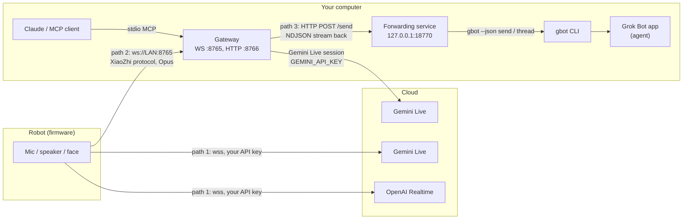
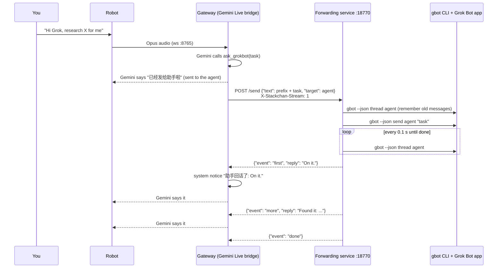

English · [中文](architecture.zh-CN.md)

# Groki Bot architecture and communication

Groki Bot has three layers. Each one is optional on top of the one before it:

1. **Firmware** on the robot (M5Stack CoreS3 with a Stack-chan base). On its own it talks to OpenAI Realtime or Gemini Live with your API key.
2. **Gateway** on your computer ([gateway/](../gateway/README.md)). The robot sends its microphone audio to the gateway instead; the gateway runs Gemini Live with a "Hi Grok" wake word and exposes an MCP server for Claude and other MCP clients.
3. **Grok Bot hand-off**. The gateway can pass tasks to an agent in the Grok Bot app through a small local forwarding service, and read the agent's replies aloud through the robot.



The same picture as text:

```
                      path 1 (firmware only)
 Robot ──wss──────────────────────────────────▶ OpenAI Realtime or Gemini Live
   │
   │ path 2: ws://<computer LAN IP>:8765 (XiaoZhi protocol, Opus audio)
   ▼
 Gateway ──────────── Gemini Live session (GEMINI_API_KEY) ───▶ Google
   ▲   │
   │   │ path 3: POST http://127.0.0.1:18770/send  (task out)
   │   ▼          ◀── NDJSON: first / more / done  (replies back)
   │ Forwarding service (stackchan-gbot-proxy)
   │   │ gbot --json send <agent> <task>
   │   │ gbot --json thread <agent>      (polled every 0.1 s)
   │   ▼
   │ Grok Bot app, signed in ── your agent does the work
   │
 Claude / MCP client (stdio MCP; starts the gateway, or talks to it while it runs)
```

## What each path needs

| | Path 1: firmware only | Path 2: + gateway | Path 3: + Grok Bot |
|---|---|---|---|
| What you get | Voice conversation, face, head motion, touch | "Hi Grok" wake word, Gemini Live voice through your computer, Claude can make the robot speak and read its status | Say "look this up" or "research X"; the robot answers "sent to the agent" right away and reads the agent's replies aloud as they arrive |
| Hardware | CoreS3 + Stack-chan base (or another supported board), USB-C cable | Plus a computer on the same Wi-Fi (macOS tested; Linux for voice) | Same computer |
| Software | Desktop Chrome or Edge for the web flasher and BLE settings page | [uv](https://docs.astral.sh/uv/), Git, libopus; optional wake word model (about 33 MB) | Grok Bot app, signed in; `gbot` CLI from [grok-bot-cli](https://github.com/ScriptedAlchemy/grok-bot-cli) (`npm install --global grok-bot-cli`; needs a recent Node.js) |
| Keys | OpenAI or Gemini API key, stored in the robot's NVS | Gemini API key in `gateway/.env`; optional shared `STACKCHAN_TOKEN` | None extra: `gbot` uses the app session; nothing Grok-related is stored by the gateway |
| Turn it on | Settings page, tab "对话" (Conversation): provider and key | Provider "XiaoZhi 服务器", URL `ws://<LAN IP>:8765` | `STACKCHAN_TOOL_BOT=<agent name>` in `gateway/.env`, run `uv run stackchan-gbot-proxy` |
| Setup steps | [README, path 1](../README.md#path-1-firmware-only) | [gateway/README.md](../gateway/README.md) | [gateway README, Grok Bot hand-off](../gateway/README.md#optional-grok-bot-hand-off) |

## 1. Firmware on its own

The conversation component (`components/conversation/`) has three clients: OpenAI Realtime (`wss://api.openai.com/v1/realtime`), Gemini Live (`wss://generativelanguage.googleapis.com/...BidiGenerateContent`) and XiaoZhi (used for path 2). The provider and API key are set over BLE or the Wi-Fi settings page and stored in NVS; nothing is compiled in. The robot streams microphone audio up and plays the reply audio, while the mouth, expressions and head follow the audio locally.

The firmware also has its own token-protected HTTP API (`/mcp/state`, `/mcp/expression`, `/mcp/balloon`, `/mcp/say`), used by [tools/stackchan-channel/](../tools/stackchan-channel/README.md) (an MCP server for Claude Code) and by the scripts in [tools/face-demo/](../tools/face-demo/README.md). That API is separate from the gateway.

## 2. Robot and gateway

**Connection.** In the settings page the provider is set to "XiaoZhi 服务器" and the URL to `ws://<computer LAN IP>:8765`. The robot opens a WebSocket with these headers:

| Header | Value |
|---|---|
| `Authorization` | `Bearer <token>`, only when a XiaoZhi token is set; must equal the gateway's `STACKCHAN_TOKEN` |
| `Protocol-Version` | `1` |
| `Device-Id` | the robot's MAC address |
| `Client-Id` | a UUID derived from the MAC address, the same across reboots |

A wrong token is rejected with HTTP 401 (`ESP32 auth rejected` in the gateway log).

**Hello.** The robot sends `{"type": "hello", "features": {"mcp": false}, "audio_params": {"format": "opus", "sample_rate": 16000, "channels": 1, "frame_duration": 60}}`. The gateway answers with its own hello and a 24 kHz downlink format. `features.mcp=false` tells the gateway that this firmware does not accept MCP tool calls from the server, so face, LED, head and camera tools from the gateway do not reach the Groki Bot firmware. Voice works fully.

**Audio.** Uplink: Opus, 16 kHz mono, 60 ms frames, as binary WebSocket messages. On the gateway the wake word detector (sherpa-onnx, runs locally) listens first; only after "Hi Grok" is audio forwarded to Gemini, and the listening window closes after `STACKCHAN_WAKE_IDLE_S` seconds of silence. Downlink: Gemini's reply audio is encoded to Opus (24 kHz, 60 ms) and sent back with `tts` state messages so the robot knows when speech starts and stops.

**Gemini Live.** The gateway keeps one Gemini Live session (`GEMINI_API_KEY`, model `gemini-3.8-live`, voice `Kore` by default) and gives Gemini a small set of function-calling tools: `end_conversation`, `get_current_datetime`, `ask_claude`, and, when you turn them on, Mac control tools and `ask_grokbot`.

**HTTP on port 8766.**

| Endpoint | Purpose |
|---|---|
| `GET /debug/status` | JSON status: robot connection, Gemini session, last errors. Use it to check setup. |
| `GET /debug/panel` | The same status as a web page |
| `POST /capture` | Photo upload from firmware that has a camera tool (needs `Authorization: Bearer` with `VISION_TOKEN` or `STACKCHAN_TOKEN`). Not used by the Groki Bot firmware. |
| `POST /debug/inject-text` | Inject a text turn into the live session, token protected |

**MCP.** `uv run stackchan-mcp` is a stdio MCP server and, in the same process, the WebSocket and HTTP servers above. Claude Code or Claude Desktop can start it (the gateway runs while the client is open), or `scripts/run_stackchan_gateway_launchd.sh` keeps it running as a background service. With the Groki Bot firmware, `speak` and `get_status` work; hardware tools return an error because of `features.mcp=false`.

## 3. The gateway's safety defaults

- Mac control (`STACKCHAN_MAC_CONTROL`), device tools for Gemini (`STACKCHAN_GEMINI_DEVICE_TOOLS`), the USB serial channel (`STACKCHAN_USB_TRANSPORT`) and the Grok Bot hand-off (`STACKCHAN_TOOL_BOT`) are all off until you set them.
- Set `STACKCHAN_TOKEN`: it guards the robot connection, `/capture` and `/debug/inject-text`.
- The forwarding service binds 127.0.0.1 only and never handles a Grok token.

## 4. Grok Bot hand-off

The Grok Bot agent runs inside the Grok Bot app and cannot reach the robot's speaker. So the gateway sends the task out, collects the agent's replies, and lets Gemini say them.



**Task out.** Gemini decides when to call `ask_grokbot(task)`. The routing rules added to Gemini's instructions say: small talk and "who are you" stay with Gemini; tasks that take time (look something up, research, write something, ask an assistant) go to the agent; with Mac control on, questions that only need an answer go to the agent instead of opening a browser search. The tool returns at once with "已经发给{agent}啦" ("sent to {agent}"), which Gemini says immediately so the user is not left in silence. The gateway puts a short prefix in front of the task (`STACKCHAN_TOOL_BOT_PREFIX`; the default asks the agent for one or two spoken sentences without lists, links or markdown) and posts it to the forwarding service with `X-Stackchan-Stream: 1`.

**Inside the forwarding service** (`gateway/stackchan_mcp/gbot_http_proxy.py`):

1. Reads the agent's thread once (`gbot --json thread <agent> --limit 20`) and remembers the existing message ids and the newest timestamp, so old messages are never replayed.
2. Runs `gbot --json send <agent> <text>` in the background.
3. Polls the thread every `STACKCHAN_GBOT_POLL_S` (0.1 s). Only bot messages (`kind: send-message`) that are new count.
4. Sends the first complete short sentence as soon as it appears: `{"ok": true, "event": "first", "reply": "..."}`.
5. Keeps following the thread. Every later message, and the rest of the first one, is sent whole once its text has stopped changing for `STACKCHAN_GBOT_STABLE_S` (0.35 s): `{"event": "more", ...}`. Earlier versions sent only the first sentence of each later message and lost the actual result; the test `test_later_message_is_sent_whole_not_just_first_sentence` guards this.
6. Ends with `{"event": "done", "reason": "idle" | "max" | "timeout"}`: after 90 s without new text (100 s when the last message looked like "working on it"), after 4 follow-up messages, or after 110 s in total. Requests to the same agent are handled one at a time so replies are not mixed up.

Errors come back as `{"ok": false, "error": "..."}` with HTTP 400 (bad request, no target), 502 (`gbot` missing or failing) or 504 (no first sentence within 30 s).

**Replies back.** In the gateway, `gbot_brain.iter_gbot_replies` reads the NDJSON lines and yields each reply. For each one the bridge pushes a system notice into the Gemini Live session: "[系统通知，不是用户发言] {agent}回话了：{reply}" (system notice, not the user: the agent replied), asking Gemini to relay it briefly in its own voice without calling tools. Gemini speaks, and the audio goes to the robot as in section 2. If nothing comes back, one notice asks Gemini to tell the user the task was not delivered, and not to make up an answer.

**Configuration** (`gateway/.env`):

| Variable | Default | Meaning |
|---|---|---|
| `STACKCHAN_TOOL_BOT` | empty, feature off | Agent (or group) name from `gbot bots list`. Setting it declares the `ask_grokbot` tool and adds the routing rules. |
| `STACKCHAN_TOOL_BOT_ID` | empty | Optional agent id, sent as `target_id` |
| `STACKCHAN_TOOL_BOT_PREFIX` | built-in read-aloud hint | Text in front of each task; empty sends the task as is |
| `STACKCHAN_GBOT_URL` | `http://127.0.0.1:18770` | Forwarding service address |
| `STACKCHAN_ASK_TIMEOUT` | `110` | Seconds the gateway waits for the whole exchange |
| `STACKCHAN_GBOT_BIN` | `gbot` on PATH | Forwarding service: `gbot` location |
| `STACKCHAN_GBOT_HTTP_PORT` | `18770` | Forwarding service port |
| `STACKCHAN_GBOT_POLL_S`, `STACKCHAN_GBOT_STABLE_S`, `STACKCHAN_GBOT_FIRST_TIMEOUT`, `STACKCHAN_GBOT_FOLLOW_S`, `STACKCHAN_GBOT_FOLLOW_IDLE_S`, `STACKCHAN_GBOT_FOLLOW_BUSY_IDLE_S`, `STACKCHAN_GBOT_FOLLOW_MAX`, `STACKCHAN_GBOT_SEND_TIMEOUT_S` | 0.1, 0.35, 30, 110, 90, 100, 4, 20 | Forwarding service timing |

**Try it without the robot:**

```bash
cd gateway
uv run stackchan-gbot-proxy &
curl -s http://127.0.0.1:18770/health
curl -sN -X POST http://127.0.0.1:18770/send \
  -H 'Content-Type: application/json' -H 'X-Stackchan-Stream: 1' \
  -d '{"text": "Reply in two short sentences: what can you do?", "target": "<agent name>"}'
```

## Code map

| Part | Where |
|---|---|
| Firmware conversation clients | `components/conversation/` (`xiaozhi_client.cpp`, `gemini_live_client.cpp`, `openai_realtime_client.cpp`) |
| Firmware settings (BLE, Wi-Fi, OTA, `/mcp/*` HTTP API) | `components/config_service/`, `components/wifi_config_service/` |
| Gateway WebSocket server and XiaoZhi protocol | `gateway/stackchan_mcp/server.py`, `protocol.py`, `esp32_client.py` |
| Wake word | `gateway/stackchan_mcp/wake_gate.py` |
| Gemini Live bridge, tools, `ask_grokbot` | `gateway/stackchan_mcp/gemini_live_bridge.py` |
| Grok Bot client in the gateway | `gateway/stackchan_mcp/gbot_brain.py` |
| Forwarding service and `gbot` wrapper | `gateway/stackchan_mcp/gbot_http_proxy.py`, `gbot_client.py` |
| HTTP on 8766 | `gateway/stackchan_mcp/capture_server.py` |
| stdio MCP server | `gateway/stackchan_mcp/stdio_server.py`, `cli.py` |
| Tests | `gateway/tests/` (`test_gbot_http_proxy.py` runs the forwarding service against a fake `gbot`) |
