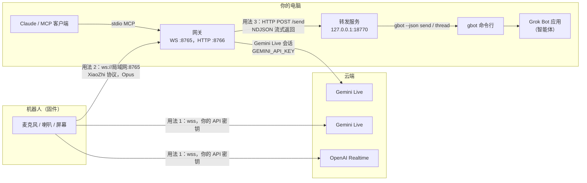
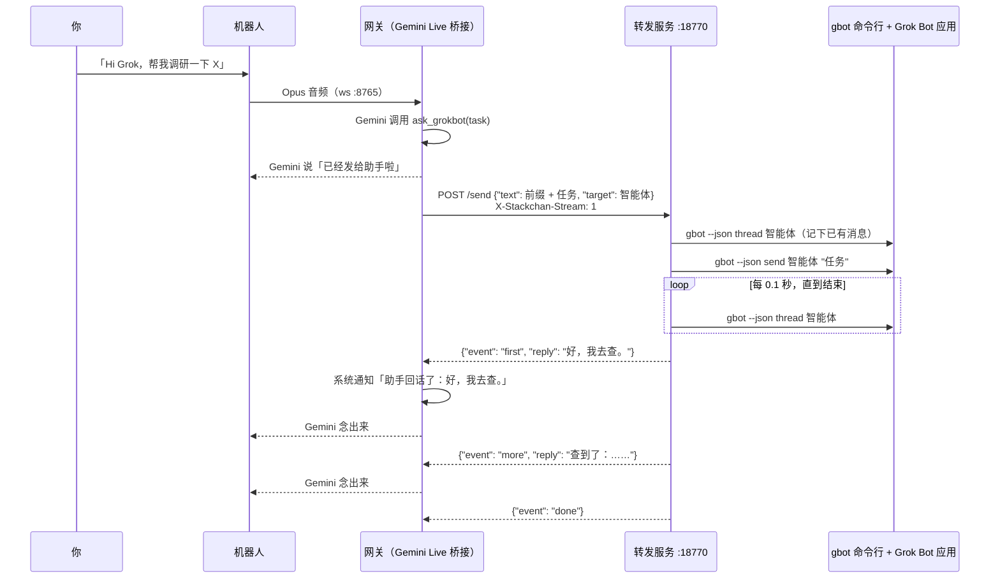

[English](architecture.md) · 中文

# Groki Bot 架构与通信说明

Groki Bot 分三层，每一层都建立在前一层之上，按需加装：

1. **固件**：跑在机器人上（M5Stack CoreS3 加 Stack-chan 底座）。单独使用时，用你自己的 API 密钥直接和 OpenAI Realtime 或 Gemini Live 对话。
2. **网关**：跑在你的电脑上（[gateway/](../gateway/README.zh-CN.md)）。机器人改为把麦克风声音发给网关，网关用「Hi Grok」唤醒词加 Gemini Live 对话，并提供 MCP 服务给 Claude 等 MCP 客户端使用。
3. **把任务交给 Grok Bot**：网关通过本机一个小的转发服务，把任务交给 Grok Bot 应用里的智能体，再让机器人把智能体的回复念出来。



文字版：

```
                      用法 1（只刷固件）
 机器人 ──wss─────────────────────────────────▶ OpenAI Realtime 或 Gemini Live
   │
   │ 用法 2：ws://<电脑局域网 IP>:8765（XiaoZhi 协议，Opus 音频）
   ▼
 网关 ─────────────── Gemini Live 会话（GEMINI_API_KEY）────▶ Google
   ▲   │
   │   │ 用法 3：POST http://127.0.0.1:18770/send （任务发出）
   │   ▼          ◀── NDJSON：first / more / done （回复传回）
   │ 转发服务（stackchan-gbot-proxy）
   │   │ gbot --json send <智能体> <任务>
   │   │ gbot --json thread <智能体>     （每 0.1 秒读取一次）
   │   ▼
   │ 已登录的 Grok Bot 应用 ── 你的智能体在这里干活
   │
 Claude / MCP 客户端（stdio MCP；由它启动网关，或连接正在运行的网关）
```

## 每种用法需要什么

| | 用法 1：只刷固件 | 用法 2：加网关 | 用法 3：再加 Grok Bot |
|---|---|---|---|
| 能做什么 | 语音对话、表情、转头、触摸反应 | 「Hi Grok」唤醒词，语音经电脑走 Gemini Live，Claude 能让机器人说话、读取状态 | 说「帮我查一下」「帮我调研 X」，机器人马上回一句「已经发给助手啦」，智能体每回一段就念一段 |
| 硬件 | CoreS3 加 Stack-chan 底座（或其他支持的板子），USB-C 线 | 再加一台和机器人在同一 Wi-Fi 的电脑（macOS 测试过，Linux 可跑语音） | 同一台电脑 |
| 软件 | 桌面版 Chrome 或 Edge（网页刷写和蓝牙设置页） | [uv](https://docs.astral.sh/uv/)、Git、libopus；唤醒词模型可选（约 33 MB） | 已登录的 Grok Bot 应用；[grok-bot-cli](https://github.com/ScriptedAlchemy/grok-bot-cli) 提供的 `gbot` 命令行（`npm install --global grok-bot-cli`，需要较新的 Node.js） |
| 密钥 | OpenAI 或 Gemini API 密钥，存在机器人的 NVS 里 | `gateway/.env` 里的 Gemini API 密钥；可选的共享令牌 `STACKCHAN_TOKEN` | 不需要额外密钥：`gbot` 使用应用的登录状态，网关不保存任何 Grok 相关凭据 |
| 怎么开启 | 设置页「对话」标签：选服务商、填密钥 | 服务商选「XiaoZhi 服务器」，URL 填 `ws://<局域网 IP>:8765` | 在 `gateway/.env` 写 `STACKCHAN_TOOL_BOT=<智能体名字>`，运行 `uv run stackchan-gbot-proxy` |
| 操作步骤 | [README 用法 1](../README.zh-CN.md#用法-1只刷固件) | [gateway/README.zh-CN.md](../gateway/README.zh-CN.md) | [网关 README：把任务交给 Grok Bot](../gateway/README.zh-CN.md#可选把任务交给-grok-bot) |

## 1. 只用固件

对话组件（`components/conversation/`）有三个客户端：OpenAI Realtime（`wss://api.openai.com/v1/realtime`）、Gemini Live（`wss://generativelanguage.googleapis.com/...BidiGenerateContent`）和 XiaoZhi（用法 2 使用）。服务商和 API 密钥通过蓝牙或 Wi-Fi 设置页写入 NVS，不编译进固件。机器人把麦克风声音传上去、播放回复的声音，嘴型、表情和头部动作在本机跟着声音变化。

固件还有一套自带令牌保护的 HTTP 接口（`/mcp/state`、`/mcp/expression`、`/mcp/balloon`、`/mcp/say`），[tools/stackchan-channel/](../tools/stackchan-channel/README.md)（给 Claude Code 用的 MCP 服务）和 [tools/face-demo/](../tools/face-demo/README.md) 里的脚本用的就是它。这套接口和网关无关。

## 2. 机器人和网关

**连接。** 在设置页把服务商设为「XiaoZhi 服务器」，URL 设为 `ws://<电脑局域网 IP>:8765`。机器人建立 WebSocket 连接时带这些请求头：

| 请求头 | 值 |
|---|---|
| `Authorization` | `Bearer <令牌>`，只在设置了 XiaoZhi 令牌时发送；必须和网关的 `STACKCHAN_TOKEN` 相同 |
| `Protocol-Version` | `1` |
| `Device-Id` | 机器人的 MAC 地址 |
| `Client-Id` | 由 MAC 地址生成的 UUID，重启后不变 |

令牌不对时网关返回 HTTP 401，日志里是 `ESP32 auth rejected`。

**握手。** 机器人发送 `{"type": "hello", "features": {"mcp": false}, "audio_params": {"format": "opus", "sample_rate": 16000, "channels": 1, "frame_duration": 60}}`，网关回一条自己的 hello，下行音频格式是 24 kHz。`features.mcp=false` 告诉网关这个固件不接受服务器发来的 MCP 工具调用，所以网关的表情、灯光、头部、拍照这些 MCP 工具到不了 Groki Bot 固件，语音功能完整可用。人脸追踪不走 MCP（见下文）。

**音频。** 上行：Opus，16 kHz 单声道，每帧 60 毫秒，用 WebSocket 二进制消息发送。网关先用本机的唤醒词检测（sherpa-onnx）听，听到「Hi Grok」（设 `STACKCHAN_WAKE_PHRASE=hey groki` 时是「Hey Groki」）之后才把声音转给 Gemini；安静 `STACKCHAN_WAKE_IDLE_S` 秒后结束这一轮聆听。下行：Gemini 回复的声音编码成 Opus（24 kHz，60 毫秒）发回机器人，同时发送 `tts` 状态消息，让机器人知道什么时候开始说、什么时候说完。

**Gemini Live。** 网关保持一个 Gemini Live 会话（`GEMINI_API_KEY`，默认模型 `gemini-3.8-live`，默认音色 `Kore`），并给 Gemini 一小组可调用的工具：`end_conversation`、`get_current_datetime`、装了 `claude` 命令行时才有的 `ask_claude`（`STACKCHAN_ASK_CLAUDE=0` 可关闭），以及开启后才有的 Mac 控制工具和 `ask_grokbot`。

**8766 端口上的 HTTP 接口。**

| 接口 | 用途 |
|---|---|
| `GET /debug/status` | JSON 状态：机器人连接、Gemini 会话、最近的错误。安装时用它检查。 |
| `GET /debug/panel` | 同样的状态，网页形式 |
| `POST /capture` | 带摄像头工具的固件上传照片（需要 `Authorization: Bearer`，值为 `VISION_TOKEN` 或 `STACKCHAN_TOKEN`）。Groki Bot 固件不使用。 |
| `POST /debug/inject-text` | 往当前会话里插入一段文字，受令牌保护 |
| `POST /track` | Mac 人脸追踪程序发来的人脸位置（见下面的人脸追踪） |

**人脸追踪。** 在带摄像头的 Mac 上，网关启动 [tools/vision-tracker](../tools/vision-tracker/README.md)（`groki-vision-tracker --endpoint http://127.0.0.1:8766/track --fps 8`），程序退出后自动重启。追踪程序用 Apple Vision 找出每帧里置信度最高的人脸，每秒最多 8 次发送 `{"x", "y", "width", "height", "confidence", "timestamp"}`（0 到 1 的画面坐标）。`TrackingBridge` 把位置换算成头部角度并做平滑，最高每秒 50 次发给机器人。因为 Groki Bot 固件没有 MCP，转头用的是 XiaoZhi 控制消息 `{"type": "head", "yaw": <-90..90>, "pitch": <0..60>, "speed": <100..1000>}`。固件把角度限制在舵机限位之内；机器人说话时只保留最后一条指令，等这段回复说完再执行。机器人说话时和唤醒后听你说话时，网关不发转头指令；「看着我」「别看了」（`self.tracking.start` / `self.tracking.stop`）打开和关闭跟随。`/debug/status` 的 `face_tracking` 一节显示状态。设置方法见[网关 README 的人脸追踪一节](../gateway/README.zh-CN.md#人脸追踪)。

**MCP。** `uv run stackchan-mcp` 是一个 stdio MCP 服务，同一个进程里也运行上面的 WebSocket 和 HTTP 服务。可以由 Claude Code 或 Claude Desktop 启动（客户端开着网关就在运行），也可以用 `scripts/run_stackchan_gateway_launchd.sh` 作为后台服务常驻。配合 Groki Bot 固件时 `speak` 和 `get_status` 可用；硬件类工具因为 `features.mcp=false` 会返回错误。

## 3. 网关的安全默认值

- Mac 控制（`STACKCHAN_MAC_CONTROL`）、给 Gemini 的设备工具（`STACKCHAN_GEMINI_DEVICE_TOOLS`）、USB 串口通道（`STACKCHAN_USB_TRANSPORT`）和交给 Grok Bot（`STACKCHAN_TOOL_BOT`）都是不设置就不开启。
- 请设置 `STACKCHAN_TOKEN`：它保护机器人连接、`/capture` 和 `/debug/inject-text`。
- 转发服务只绑定 127.0.0.1，从不接触 Grok 令牌。

## 4. 把任务交给 Grok Bot

Grok Bot 的智能体运行在 Grok Bot 应用里，碰不到机器人的喇叭。所以由网关把任务发出去、收回智能体的回复，再让 Gemini 念出来。



**任务发出。** 什么时候调用 `ask_grokbot(task)` 由 Gemini 判断。加进 Gemini 指令里的分流规则是：闲聊和「你是谁」由 Gemini 自己回答；要花时间办的事（查资料、调研、写东西、叫助手）交给智能体；开了 Mac 控制时，只想要答案的问题也交给智能体，不去打开浏览器搜索。工具立刻返回（「Sent to {智能体}.」），并要求 Gemini 马上用用户的语言告诉用户任务已经发出，用户不用干等。网关在任务前面加一段前缀（`STACKCHAN_TOOL_BOT_PREFIX`，默认要求智能体用一两句口语回答，不用列表、链接和 markdown），带上 `X-Stackchan-Stream: 1` 发给转发服务。

**转发服务内部**（`gateway/stackchan_mcp/gbot_http_proxy.py`）：

1. 先读一次智能体的对话（`gbot --json thread <智能体> --limit 20`），记下已有消息的 ID 和最新时间戳，旧消息永远不会重播。
2. 在后台运行 `gbot --json send <智能体> <文字>`。
3. 每 `STACKCHAN_GBOT_POLL_S`（0.1 秒）读一次对话，只认新的机器人消息（`kind: send-message`）。
4. 第一句完整的短句一出现就发出：`{"ok": true, "event": "first", "reply": "..."}`。
5. 继续跟着对话。之后的每条消息，以及第一条消息剩下的部分，等文字 `STACKCHAN_GBOT_STABLE_S`（0.35 秒）内不再变化后整条发出：`{"event": "more", ...}`。旧版本对后续消息只发第一句，智能体真正的结论常在第二句，会被丢掉；测试 `test_later_message_is_sent_whole_not_just_first_sentence` 防止这个问题复发。
6. 最后发 `{"event": "done", "reason": "idle" | "max" | "timeout"}`：90 秒没有新文字（上一条看起来是「我去办了」时为 100 秒）、后续消息满 4 条、或总共 110 秒。发给同一个智能体的请求逐个处理，回复不会串。

出错时返回 `{"ok": false, "error": "..."}`：请求不合法或没指定智能体是 HTTP 400，`gbot` 找不到或执行失败是 502，30 秒内没有第一句是 504。

**回复传回。** 网关里的 `gbot_brain.iter_gbot_replies` 逐行读取 NDJSON，每收到一段回复，桥接层就往 Gemini Live 会话里推一条系统通知：「[System notice, not the user speaking] {智能体} replied: {回复}」，要求 Gemini 用自己的声音、用用户的语言简短转述，不调用工具。Gemini 说出来，声音按第 2 节的方式传到机器人。如果什么都没收到，就推一条通知，让 Gemini 告诉用户任务没送到，并且不要编造回复。

**配置**（`gateway/.env`）：

| 变量 | 默认值 | 作用 |
|---|---|---|
| `STACKCHAN_TOOL_BOT` | 空，功能关闭 | `gbot bots list` 里的智能体（或群组）名字。填了才声明 `ask_grokbot` 工具并加入分流规则。 |
| `STACKCHAN_TOOL_BOT_ID` | 空 | 可选的智能体 ID，作为 `target_id` 发送 |
| `STACKCHAN_TOOL_BOT_PREFIX` | 内置的朗读提示 | 加在每个任务前面的文字；设为空则原样发送 |
| `STACKCHAN_GBOT_URL` | `http://127.0.0.1:18770` | 转发服务地址 |
| `STACKCHAN_ASK_TIMEOUT` | `110` | 网关等待整个过程的秒数 |
| `STACKCHAN_GBOT_BIN` | PATH 里的 `gbot` | 转发服务使用的 `gbot` 路径 |
| `STACKCHAN_GBOT_HTTP_PORT` | `18770` | 转发服务端口 |
| `STACKCHAN_GBOT_POLL_S`、`STACKCHAN_GBOT_STABLE_S`、`STACKCHAN_GBOT_FIRST_TIMEOUT`、`STACKCHAN_GBOT_FOLLOW_S`、`STACKCHAN_GBOT_FOLLOW_IDLE_S`、`STACKCHAN_GBOT_FOLLOW_BUSY_IDLE_S`、`STACKCHAN_GBOT_FOLLOW_MAX`、`STACKCHAN_GBOT_SEND_TIMEOUT_S` | 0.1、0.35、30、110、90、100、4、20 | 转发服务的时间参数 |

**不接机器人单独试：**

```bash
cd gateway
uv run stackchan-gbot-proxy &
curl -s http://127.0.0.1:18770/health
curl -sN -X POST http://127.0.0.1:18770/send \
  -H 'Content-Type: application/json' -H 'X-Stackchan-Stream: 1' \
  -d '{"text": "用两句话回答：你能做什么？", "target": "<智能体名字>"}'
```

## 代码位置

| 部分 | 位置 |
|---|---|
| 固件对话客户端 | `components/conversation/`（`xiaozhi_client.cpp`、`gemini_live_client.cpp`、`openai_realtime_client.cpp`） |
| 固件设置（蓝牙、Wi-Fi、OTA、`/mcp/*` HTTP 接口） | `components/config_service/`、`components/wifi_config_service/` |
| 网关 WebSocket 服务和 XiaoZhi 协议 | `gateway/stackchan_mcp/server.py`、`protocol.py`、`esp32_client.py` |
| 唤醒词 | `gateway/stackchan_mcp/wake_gate.py` |
| Gemini Live 桥接、工具、`ask_grokbot` | `gateway/stackchan_mcp/gemini_live_bridge.py` |
| 网关里的 Grok Bot 客户端 | `gateway/stackchan_mcp/gbot_brain.py` |
| 转发服务和 `gbot` 封装 | `gateway/stackchan_mcp/gbot_http_proxy.py`、`gbot_client.py` |
| 8766 端口 HTTP | `gateway/stackchan_mcp/capture_server.py` |
| 人脸追踪：追踪程序进程、头部角度换算 | `gateway/stackchan_mcp/face_tracker.py`、`tracking_bridge.py`；`tools/vision-tracker/` |
| 固件的 `head` 消息 | `components/conversation/include/conversation/control_dispatch.hpp`、`main/conversation_task.cpp` |
| stdio MCP 服务 | `gateway/stackchan_mcp/stdio_server.py`、`cli.py` |
| 测试 | `gateway/tests/`（`test_gbot_http_proxy.py` 用假的 `gbot` 跑真实的转发服务） |
